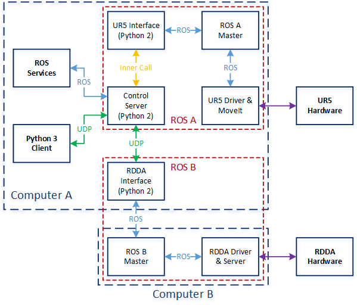

# RDDA UR5 Control

A ROS package for controlling the Remote Direct-Drive Actuator (RDDA) with Universal Robots UR5/UR5e at Northeastern University, Boston.

## System Structure

## Installtion

- [ROS Kinetic Kame](http://wiki.ros.org/kinetic/Installation/Ubuntu)

- [catkin](http://wiki.ros.org/catkin)

- [Universal Robots ROS Driver](https://github.com/UniversalRobots/Universal_Robots_ROS_Driver)

- [MoveIt!](https://moveit.ros.org/install/)

## Configuration

- Setup ROS A master's IP: `export ROS_IP=192.168.0.151 -> .bashrc`

- Setup ROS B master's IP in [rdda_comm_bridge.py](./scripts/rdda/rdda_comm_bridge.py#L87)

- Setup `robot_type` and `robot_ip` in [control_core.py](./scripts/control_core.py#L17).

## Usage

### Start the control server

`roslaunch rdda_ur5_control control_server.launch`

### RDDA services

- `rosservice call /rdda_ur5_control/set_rdda_stiffness -- finger1 finger2`
- `rosservice call /rdda_ur5_control/init_rdda_stiffness`
- `rosservice call /rdda_ur5_control/set_rdda_positions -- finger1 finger2`
- `rosservice call /rdda_ur5_control/set_rdda_max_velocities -- finger1 finger2`
- `rosservice call /rdda_ur5_control/set_rdda_max_efforts -- finger1 finger2`
- `rosservice call /rdda_ur5_control/home_rdda`
- `rosservice call /rdda_ur5_control/read_rdda_positions`
- `rosservice call /rdda_ur5_control/read_rdda_lower_bounds`
- `rosservice call /rdda_ur5_control/read_rdda_upper_bounds`
- `rosservice call /rdda_ur5_control/read_rdda_origins`

### UR5 services

- `rosservice call /rdda_ur5_control/read_ur5_position`
- `rosservice call /rdda_ur5_control/move_ur5 -- x y z roll pitch yaw velocity`
- `rosservice call /rdda_ur5_control/move_ur5_trajectory -- step_size step_num velocity wait`
- `rosservice call /rdda_ur5_control/move_ur5_linear -- axis target velocity wait`
- `rosservice call /rdda_ur5_control/stop_ur5`
- `rosservice call /rdda_ur5_control/home_ur5`

## Control Client for Python 3 Scripts

Example: [control_client_py3.py](./client/control_client_py3.py)

## Contribution

NSF project: *Controllable Compliance: A New Robotic Arm for Contact-Rich Manipulation*

## Acknowledgement

This project uses the code from [MoveIt!](https://moveit.ros.org/) and the GitHub repository 
[rdda_interface](https://github.com/RoboticsCollaborative/rdda_interface).
